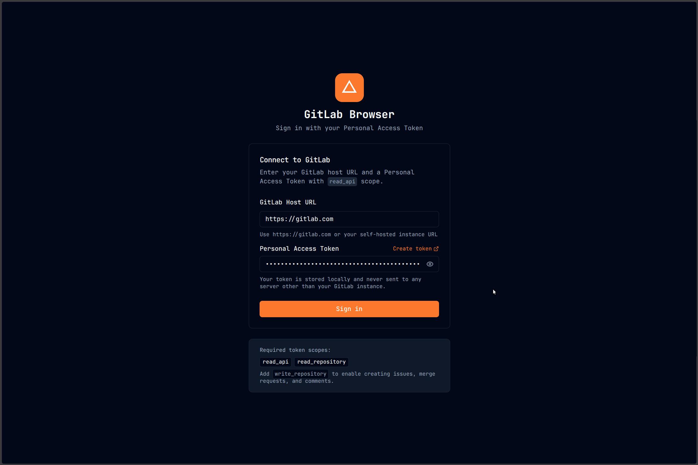
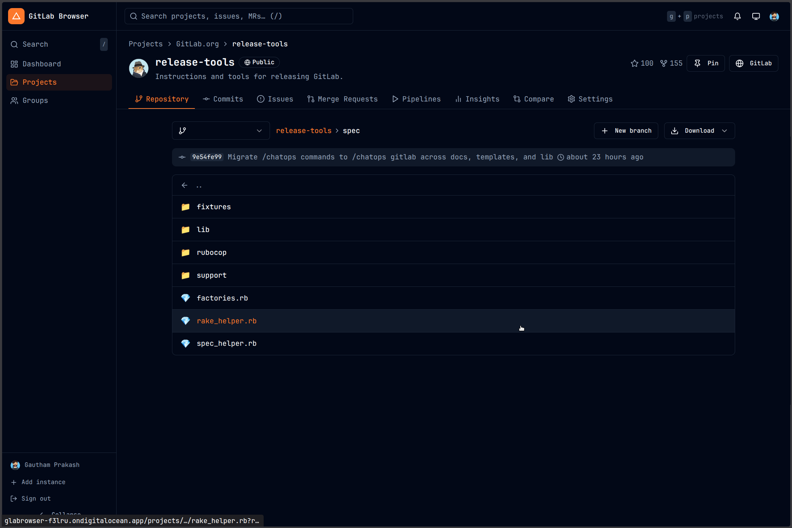
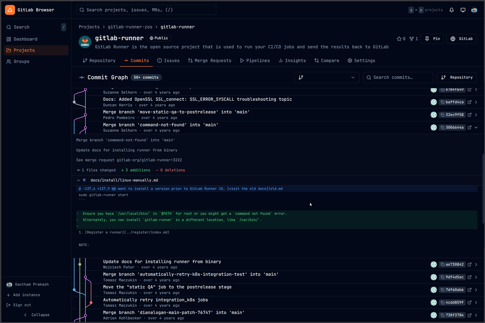
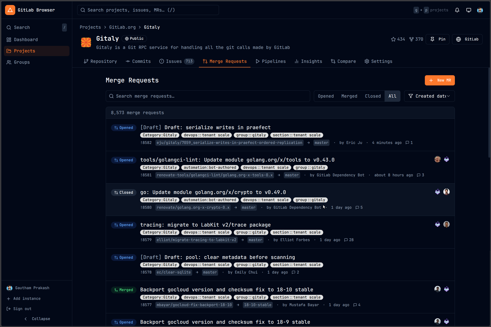
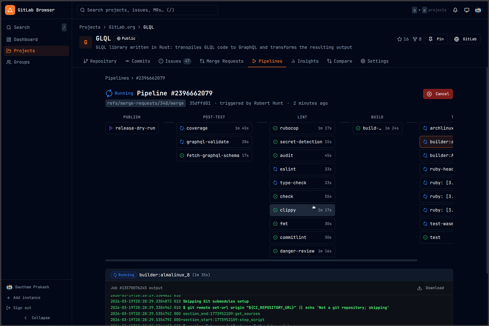
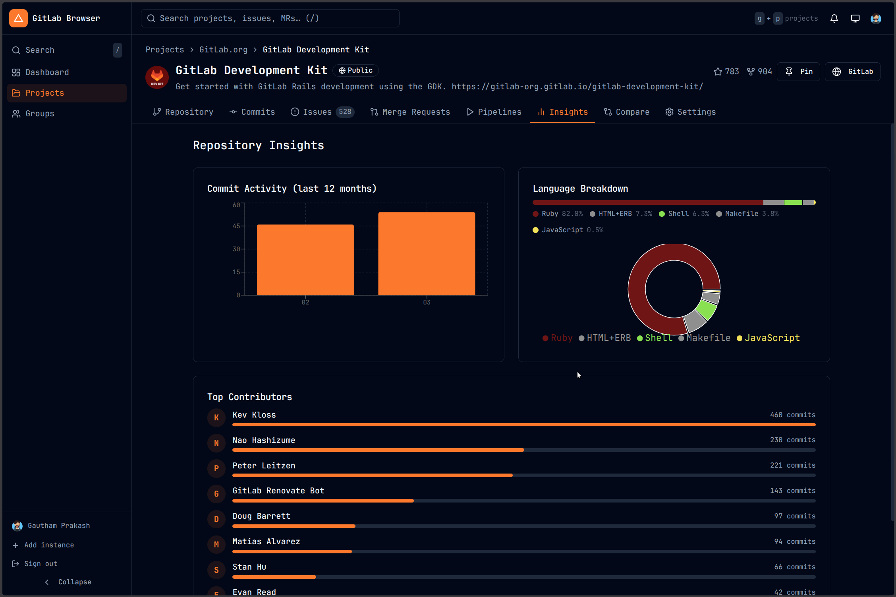

# GitLab Browser

A modern, self-hostable GitLab frontend that works with **public repositories out of the box** and optionally authenticates with a Personal Access Token — no OAuth, no user licenses required. Browse public projects without any account, or sign in with a PAT to access private repos and write actions.

[](https://github.com/gauthamp10/glabrowser/actions/workflows/ci.yml)
[](https://github.com/gauthamp10/glabrowser/actions/workflows/security.yml)
[](LICENSE)
[](Dockerfile)
[](https://react.dev)
[](https://www.typescriptlang.org)
[](https://glabrowser-bchpz.ondigitalocean.app/)

> **🌐 Live demo:** [https://glabrowser-bchpz.ondigitalocean.app/](https://glabrowser-bchpz.ondigitalocean.app/) — browse public GitLab repositories instantly.

> **Note**: This project is not affiliated with or endorsed by GitLab Inc. It uses the public [GitLab REST API](https://docs.gitlab.com/api/rest/).

---

## Screenshots

| Login | Dashboard |
|-------|-----------|
|  |  |

| Git Graph | Merge Requests |
|-----------|----------------|
|  |  |

| Pipelines | Insights |
|-----------|----------|
|  |  |

---

## Features

### Repository
- **File browser** — tree view with branch/tag switcher, breadcrumb navigation
- **Syntax-highlighted file viewer** — powered by Shiki with multi-language support
- **Git graph** — interactive commit history with SVG branch/merge visualization, expandable per-commit diffs, copy SHA, load-more pagination
- **Create branch** — create branches from any ref without leaving the app
- **Download archive** — authenticated ZIP / tar.gz download for any ref

### Code Review
- **Merge Requests** — list (open / merged / closed / all), full detail view with unified diff, approve, merge, close, reopen
- **Create MR** — in-app form with branch selectors, draft toggle, squash option
- **Issues** — list (open / closed / all), detail with comments, close/reopen

### CI/CD
- **Pipelines** — list with status filter, retry/cancel, trigger new runs
- **Pipeline detail** — stage graph, per-job log viewer with ANSI colour, retry individual jobs

### Project Management
- **Project Settings** — edit name, description, visibility; manage branches (set default, delete protected/unprotected); configure merge method, auto-delete source branch, pipeline requirements; archive / delete project
- **Insights** — commit activity chart, language breakdown, top contributors
- **Branch comparison** — diff between any two refs

### Navigation & UX
- **Dashboard** — contribution heatmap, recent projects, activity feed (clickable, navigates in-app)
- **Multi-instance switcher** — connect to gitlab.com and self-hosted instances simultaneously
- **Dark / Light / System theme**
- **Pinned projects** in sidebar
- **Global search** — projects, issues, MRs, commits, code
- **Groups** — list, detail with subgroups and projects
- **User profiles** — contribution heatmap and activity
- **Keyboard shortcuts**
- **PAT scope gates** — write actions are visually disabled (greyed out with tooltip) when your token lacks the required scope, rather than hidden

---

## Quick Start

### Docker Compose (recommended)

```bash
git clone https://github.com/gauthamp10/glabrowser.git
cd glabrowser

docker compose up --build
```

Open **http://localhost:3000**. You can browse public repositories immediately — no account needed. Optionally enter a Personal Access Token to access private repos and write actions.

### Docker (manual)

```bash
docker build -t gitlab-browser .
docker run -d -p 3000:80 --name gitlab-browser --restart unless-stopped gitlab-browser
```

### Changing the port

Edit `docker-compose.yml`:

```yaml
ports:
  - "8080:80"   # expose on port 8080 instead of 3000
```

---

## Local Development

**Prerequisites:** Node.js 20+ and npm 10+

```bash
git clone https://github.com/gauthamp10/glabrowser.git
cd glabrowser

npm install
npm run dev        # starts at http://localhost:5173
```

Public repositories on gitlab.com are accessible immediately without any token.

```bash
npm run build      # production build → dist/
npm run preview    # preview the production build locally
```

---

## Self-Hosting

The app is a fully static SPA — the compiled `dist/` folder can be served from any web server or static host (Nginx, Caddy, Apache, Netlify, GitHub Pages, etc.).

### Behind a reverse proxy (Nginx example)

```nginx
server {
    listen 80;
    server_name gitlab-browser.example.com;

    location / {
        proxy_pass http://localhost:3000;
    }
}
```

Or serve the static files directly from the built `dist/` directory — just ensure your web server is configured to fall back to `index.html` for all routes (SPA fallback).

### HTTPS

Wrap the Docker container behind a reverse proxy (Nginx, Traefik, Caddy) that terminates TLS. The app itself only needs to serve plain HTTP internally.

---

## Personal Access Token Scopes

A token is **optional** — public repositories on any GitLab instance are accessible without one. A PAT is required only for private repositories, write operations, and CI/CD features.

Create a token at `https://YOUR_GITLAB/-/user_settings/personal_access_tokens`

| Scope | Purpose | Required for |
|-------|---------|-------------|
| `read_api` | Read all API resources | Browsing projects, issues, MRs, pipelines |
| `read_repository` | Read repository files and archives | File viewer, download archive |
| `api` | Full read + write API access | Creating/updating MRs, issues, branches; project settings; star/unstar |
| `write_repository` | Write to repositories | Create / delete branches (alternative to `api`) |

**Minimum for read-only use:** `read_api` + `read_repository`  
**Minimum for full functionality:** `api`

> The app detects your token's scopes automatically and disables write actions with an explanatory tooltip when a required scope is missing.

**Quick-fill link:**
```
https://YOUR_GITLAB/-/user_settings/personal_access_tokens?name=gitlab-browser&scopes=read_api,read_repository,api
```

---

## Security

GitLab Browser is designed with a security-first approach to Personal Access Token handling and browser hardening.

**Token protection**
- PATs are encrypted at rest using **AES-GCM-256 (WebCrypto)** — `localStorage` never contains a plaintext token
- The encryption key is stored only in `sessionStorage` and is gone when the browser session ends, so encrypted blobs are useless after a restart
- Tokens are transmitted exclusively via the `PRIVATE-TOKEN` request header — they never appear in URLs, browser history, or server logs
- All API calls go directly from your browser to your GitLab instance; no third-party server ever receives your token
- Token revocation is instant — delete the token from GitLab's settings page and access is removed immediately

**Browser hardening**
- **Content Security Policy** — `script-src 'self'` (no `unsafe-inline`); `connect-src 'self' https:` (plaintext HTTP blocked); `object-src 'none'`; `base-uri 'self'`
- **Strict-Transport-Security** — instructs browsers to enforce HTTPS for all future visits (1 year, `includeSubDomains`)
- **Permissions-Policy** — camera, microphone, geolocation, payment, and USB access are all disabled
- **X-Content-Type-Options: nosniff** — prevents MIME-type sniffing
- **Referrer-Policy: strict-origin-when-cross-origin** — limits Referer header exposure

**Infrastructure**
- The Docker image runs nginx as a **non-root user** (`USER nginx`)
- A warning is shown in the UI if you configure a GitLab host using `http://` instead of `https://`
- PAT scope detection — write actions are automatically greyed out with a tooltip when your token lacks the required scope

---

## Keyboard Shortcuts

| Shortcut | Action |
|----------|--------|
| `/` | Focus global search |
| `g` `d` | Go to Dashboard |
| `g` `p` | Go to Projects |
| `g` `g` | Go to Groups |

---

## Tech Stack

| Technology | Version | Purpose |
|-----------|---------|---------|
| React | 18 | UI framework |
| TypeScript | 5 | Type safety |
| Vite | 5 | Build tool & dev server |
| React Router | v6 | Client-side routing |
| TanStack Query | v5 | Data fetching & caching |
| Zustand | v4 | State management (auth, settings) |
| Tailwind CSS | v3 | Styling |
| Radix UI | — | Accessible UI primitives |
| Shiki | v1 | Syntax highlighting |
| Recharts | — | Charts & insights |
| date-fns | v3 | Date formatting |
| Lucide React | — | Icons |
| nginx | alpine | Production static file server |

---

## Project Structure

```
src/
├── api/                 # GitLab REST API client modules
│   ├── client.ts        # Core fetch wrapper (auth headers, pagination)
│   ├── projects.ts      # Projects, branches, commits, tags
│   ├── mergeRequests.ts # MR list, create, update, approve, merge
│   ├── issues.ts        # Issue list and management
│   ├── pipelines.ts     # Pipelines and job traces
│   ├── repository.ts    # File tree, file content, archive download
│   └── ...
├── components/
│   ├── common/          # Shared components (avatar, heatmap, PermGate…)
│   ├── layout/          # App shell, sidebar, project nav
│   ├── mergeRequests/   # MR-specific components
│   ├── pipelines/       # Pipeline status, job log viewer
│   ├── repository/      # CreateBranchDialog
│   └── ui/              # Base UI components (shadcn-style)
├── hooks/               # Custom React hooks (debounce, pagination, token permissions…)
├── pages/
│   └── project/         # Repository, Commits (git graph), Issues, MRs,
│                        # Pipelines, Settings, Compare, Insights…
├── store/               # Zustand stores (auth, settings)
├── types/               # GitLab API TypeScript interfaces
└── utils/
    ├── crypto.ts        # WebCrypto AES-GCM encryption for localStorage
    ├── gitGraph.ts      # Lane-assignment algorithm for git graph SVG
    ├── format.ts        # Date, file size, number formatters
    └── ...
```

---

## Contributing

Contributions are welcome!

1. Fork the repository
2. Create a feature branch: `git checkout -b feature/my-feature`
3. Commit your changes with a descriptive message
4. Push and open a Pull Request

Please follow the existing code style (TypeScript strict, Tailwind for styling, no new external dependencies without discussion).

---

## License

[MIT](LICENSE) © 2025 — free to use, self-host, and modify.
